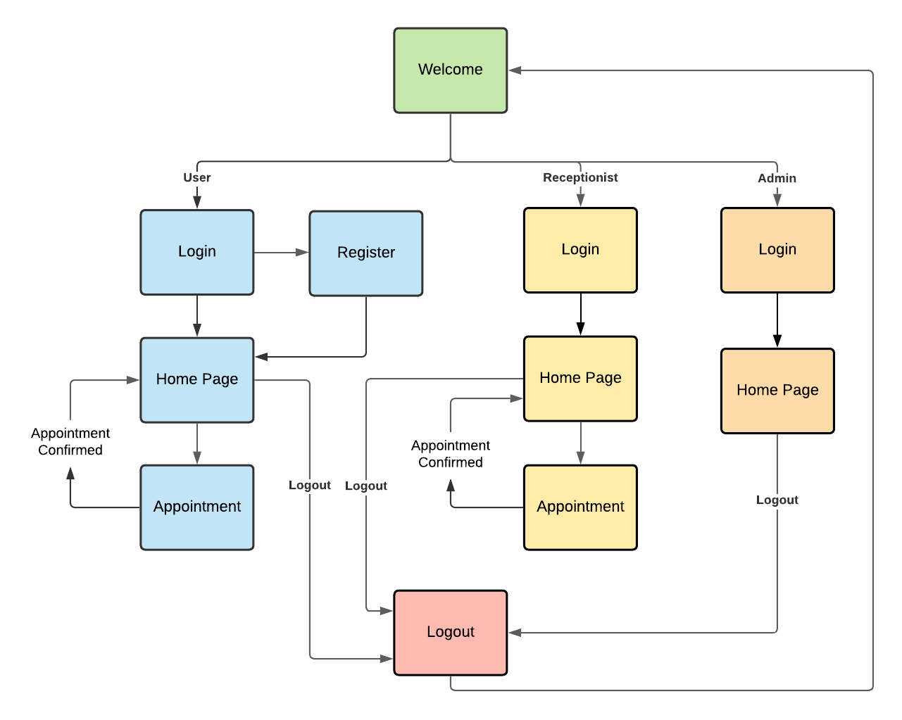

# Nova Clinic

This is a web application that helps health centers provide users with an easy way to book a doctor’s appointment online. It also allows the health centers to manage their appointments.

## Table of contents
- [Demo](#Demo)
- [Flowchart](#Flowchart)
- [Technologies used](#Technologies-used)
- [Setup & Installation](#Setup--Installation)
- [Running The App](#Running-The-App)
- [Viewing The App](#Viewing-The-App)

## Demo
https://user-images.githubusercontent.com/58914306/213848047-cf210b6f-bb15-4b05-9a7d-d06ee5c8b42f.mp4

## Flowchart


## Technologies used
- [Flask](https://flask.palletsprojects.com/en/2.0.x/)
- [MySQL](https://www.mysql.com/)
- HTML
- CSS
- JavaScript


## Setup & Installation

Make sure you have Python and MySQL installed.

- Clone the repository
    ```bash
    git clone https://github.com/Abhiram-DLVSS/NovaClinic
    ```

- Install the required Python packages
    ```bash
    pip install -r requirements.txt
    ```

- Run the [setupDatabase.sql](setupDatabase.sql) script file in your MySQL terminal to create the Database (Database Name: nova)

    ```mysql
    mysql -u root -p
    source [Repository_Directory]//NovaClinic//setupDatabase.sql;
    ```

- Go to the [sqlhandler.py](Application/DBHandler/sqlhandler.py) file at NovaClinic/Application/DBHandler/ and replace `sqlpassword` in 5th line with your MySQL Password.

## Running The App

```bash
python main.py
```

## Viewing The App

- [Welcome Page](http://127.0.0.1:5000/)
- [User's Homepage](http://127.0.0.1:5000/home)
    - Create a new account as a user
- [Receptionist Page](http://127.0.0.1:5000/receptionist)
    - Receptionist Credentials-
        Username:Nova001
        Password:Test@1234
- [Admin Page](http://127.0.0.1:5000/admin)
    - Admin Credentials-
        Username:Admin001
        Password:Test@1234
- Note:
    - One must logout from one portal(Admin,Receptionist,User) before visiting another
